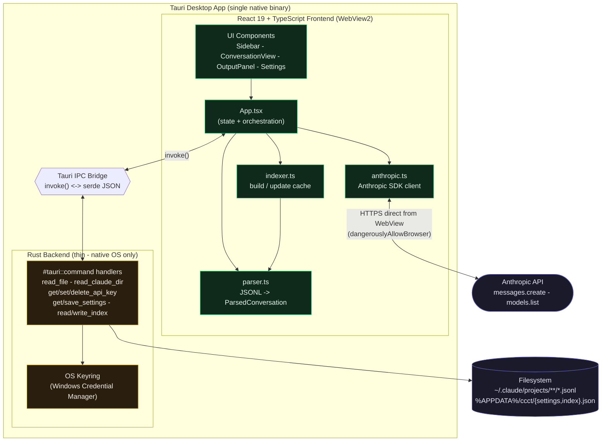
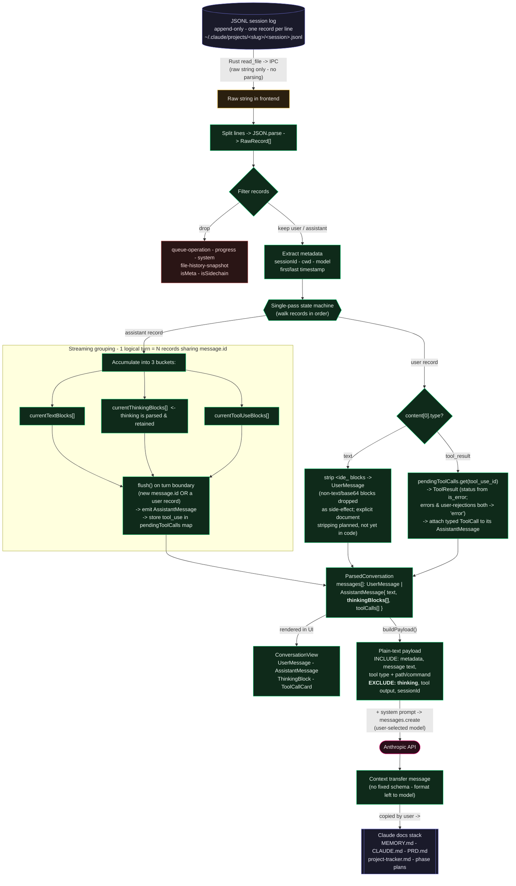

# Architecture Diagrams

The canonical visual reference for CCCT v1, fact-checked against the shipped code (`src/`, `src-tauri/`).

- **Diagram 1 - System Architecture**: macro view of the components and the build decisions.
- **Diagram 2 - Data Flow / Pipeline**: micro view of how a session log becomes a context-transfer message.

For the React-level detail these diagrams don't cover (folder structure, component render tree, state ownership), see [`ARCHITECTURE.md`](ARCHITECTURE.md). The parser itself is [`src/lib/parser.ts`](../../src/lib/parser.ts).

---

## 1. System Architecture (macro view)

**Build decisions shown visually:**

- **Tauri over Electron** -> one native binary using the OS WebView2 instead of a bundled Chromium. See [ADR-001](../decisions/adr-001-tauri-over-electron.md).
- **Rust over Node** -> the backend box owns *only* native work (filesystem, keyring, persistence) and never parses. See [ADR-003](../decisions/adr-003-typescript-parser.md).
- The **IPC bridge** (`invoke()` <-> serde JSON) is the sole channel between frontend and backend; every privileged operation crosses it.
- The **Anthropic call goes directly from the WebView over HTTPS** (`dangerouslyAllowBrowser: true`), not through Rust.

---

## 2. Data Flow / Pipeline (micro view)

**Key facts the pipeline encodes:**

- **Parsing is entirely TypeScript** ([`parser.ts`](../../src/lib/parser.ts)). The Rust -> IPC hop is pure transport - it hands over a raw string; no structuring happens there. See [ADR-003](../decisions/adr-003-typescript-parser.md).
- **Thinking blocks are first-class parsed data** - accumulated into `currentThinkingBlocks[]`, retained on `AssistantMessage.thinkingBlocks`, and rendered in the UI. They are dropped *only* at the `buildPayload()` boundary (internal reasoning is noise for a continuation prompt).
- **`ParsedConversation` forks two ways** - it both renders in `ConversationView` and feeds `buildPayload()`.
- **Errors and user-rejections both collapse to `status: 'error'`** (same `is_error: true` shape on the `tool_result` block).
- The final hop to the docs stack is **manual** (the user copies from OutputPanel); nothing writes MEMORY.md / CLAUDE.md automatically.

> **Footnote - base64 / `document` blocks:** non-text content blocks (including base64 `document` attachments) are dropped only as a *side-effect* of the text-only filter in [`parser.ts`](../../src/lib/parser.ts) (`block.type === "text"`). There is no explicit `document`-block stripping in the code - treat that as planned, not shipped.

---

*Not shown: the indexer caching path. On launch, `App.tsx` runs every session file through the same `parseJsonl` to build a lightweight `index.json` cache (first message + date + sessionId per file) so the sidebar loads instantly. It reuses the same parser as Diagram 2's pipeline.*
